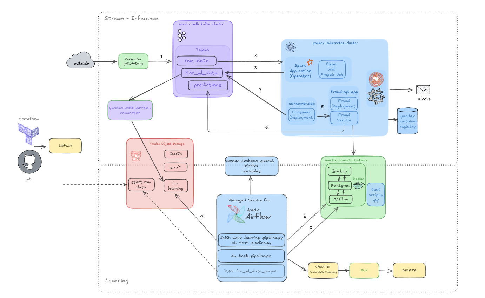
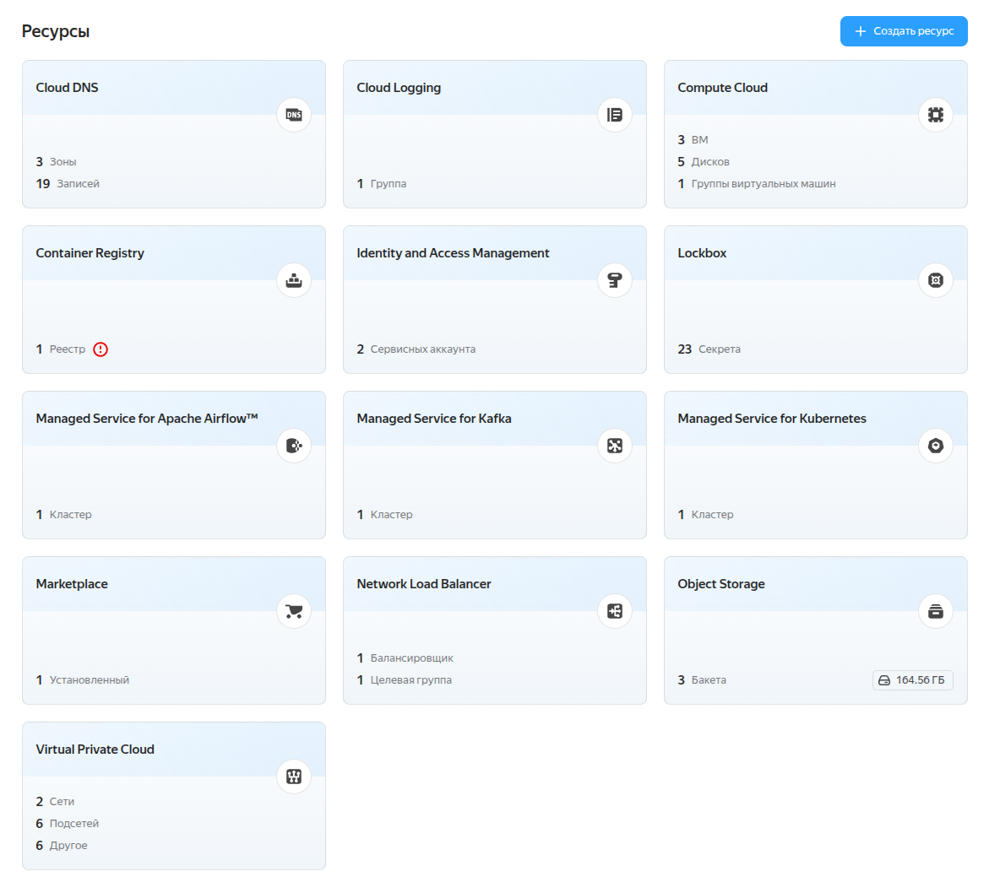
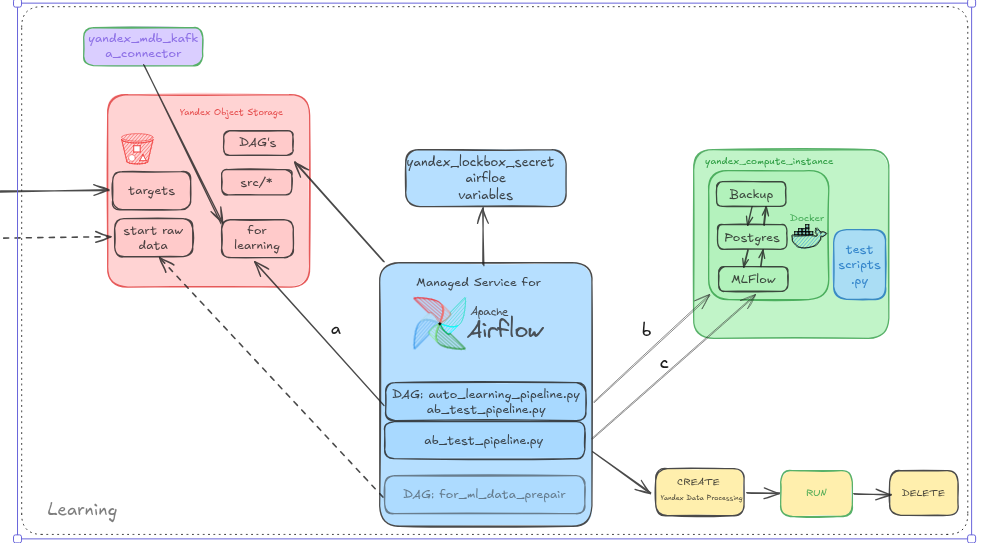

.

Задания:
1-3 Для осуществления заданной политики подготовлены манифесты (шаблоны) для deployment, service и hpa (HorizontalPodAutoscaler) (,/restapi/k8s/).
Манифесты разворачиваются через github actions.

Apache AirFlow разворачивается так же как и в предыдущих ДЗ.

Для развёртывания сервера prometeus и grafana создан модуль terraform (infra/modules/prometeus) где развёртывание происходит через helm_release, используя манифест prometheus-values.yaml.

.

.

4-5. В grafana создан дашбоард с графиками:
 - загрузки подов
 - количества активных подов
 - доли фрода в предсказаниях
 - времени обработки запросов

.

Созданы алерты на преввышения предела загрузки пода и увеличения количества подов.

.

.

Дашбоард и алерты сохраненя в json ./grafana/

Настроена оповещение в телеграм.

.

Для создания нагрузки использовался немного переработанный скрипт stress_test.py (stress_test_rest_api.py), который по мере работы увеличивает количество отправленных данных.
Тестирование проводилось с vm внутри облака, заггрузить поды до 80 % не удалось, поэтому для тестирования алертов был занижен порог сработки
